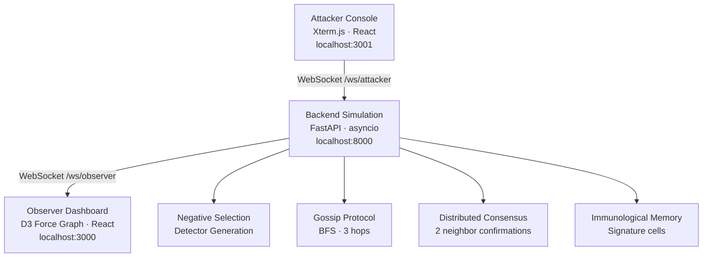

# SentinelMesh

> A bio-inspired anomaly detection system modeled on Artificial Immune Systems theory — 
> distributed suspicion propagation, gossip-based consensus, and immunological memory 
> across a mesh network.


---

## The Idea

Biological immune systems don't have a central brain. Each cell independently decides 
what's self and what's non-self, signals neighbors when something looks wrong, and 
builds memory so future threats are caught faster. SentinelMesh asks: what if a network 
intrusion detection system worked the same way?

The core mechanism comes from the **Negative Selection Algorithm** — a computational 
model of how T-cells learn to distinguish normal tissue from foreign agents. Each node 
in the mesh generates a set of detectors trained on its own "normal" traffic signature. 
Anything that triggers enough detectors is treated as non-self — a potential intrusion.

No node has the full picture. Detection is a collective property that emerges from local 
decisions and peer communication.

---

## How Detection Works

### 1. Detector Generation (Negative Selection)
At startup, each node runs `_negative_selection()` — generating 50 random signatures 
that are at least 0.34 euclidean distance from the node's baseline (normal) signature. 
These are the detectors. Anything close to normal is excluded by construction, so 
detectors only fire on genuinely anomalous inputs.

### 2. Suspicion Scoring
Every 50ms, the simulation ticks. If a node is under attack, `_attack_ramp()` increases 
its suspicion score based on attack intensity, whether the signature hits memory cells 
from past attacks, and whether a neighboring node already sent a danger signal 
(sensitization). Suspicion decays exponentially when attacks stop.

### 3. Danger Signals
When suspicion crosses **0.4**, the node broadcasts a danger signal to immediate 
neighbors — dropping their detection threshold. This is the computational analog of 
cytokine signaling: nearby cells become more sensitive when one cell detects a threat.

### 4. Gossip Propagation
When suspicion crosses **0.5**, the node initiates gossip — a bounded BFS up to 3 hops 
— informing the wider mesh of its state and collecting neighbor confirmations.

### 5. Distributed Consensus
A node is only flagged as compromised when at least **2 direct neighbors confirm** the 
suspicion within a 50-tick window. Single-node detections don't fire alerts. This 
eliminates false positives from noisy local signals and forces the detection to be a 
network-level agreement.

### 6. Immunological Memory
Confirmed attack signatures are committed to `memory_cells`. Future attacks with the 
same signature bypass the full ramp-up — the network remembers and responds faster.

### APT Detection
Slow lateral movement attacks (APT) are intentionally capped at suspicion **0.46** — 
just under the gossip threshold — to simulate how advanced threats try to stay below 
detection thresholds. A separate `_check_apt()` mechanism runs a wide-net distributed 
check specifically designed to catch this pattern, which a single-node threshold 
detector would miss by design.

---

## Architecture



---

## Stack

| Layer | Technology |
|---|---|
| Backend | Python, FastAPI 0.124, Uvicorn, NumPy |
| Observer | React 19, Vite 7, TypeScript, D3-Force |
| Attacker | React 19, Vite 7, TypeScript, Xterm.js |
| Launcher | PowerShell |

---

## Running locally

**Prerequisites:** Python 3.11+, Node.js 18+, PowerShell 7+

```powershell
git clone https://github.com/neswanths/sentinel-mesh.git
cd sentinel-mesh
.\start.ps1
```

Once running:
- Observer dashboard → http://127.0.0.1:3000
- Attacker console → http://127.0.0.1:3001

---

## Demo Commands

Type these in the attacker console:
attack brute 7          # brute force attack on node 7
attack lateral 3        # lateral movement starting at node 3
attack apt 3 7 11 15 19 # slow APT across multiple nodes
stop --all              # stop all attacks
status                  # view suspicion scores across mesh
move 7                  # relocate attack to node 7
help                    # list all commands

---

## Project Structure
```
sentinel-mesh/
├── backend/
│   ├── main.py          # FastAPI app, WebSocket endpoints, lifespan hook
│   ├── simulation.py    # Core AIS simulation — NSA, gossip, consensus, memory
│   ├── models.py        # NodeState, Attack, suspicion state machine
│   └── config.py        # Thresholds, topology, demo mode toggle
├── observer/            # D3 force graph dashboard (React/Vite)
├── attacker/            # Xterm.js attacker terminal (React/Vite)
└── start.ps1            # Single-command launcher
```

---

## Current Status

Working simulation of an Artificial Immune Systems-based IDS. The gossip protocol, 
consensus mechanism, danger signaling, and immunological memory are fully implemented. 
The network topology is a hardcoded 20-node mesh.

`DEMO_MODE = True` in `config.py` uses a linearized suspicion ramp for stable 
demonstrations. Setting it to `False` engages the full Negative Selection Algorithm 
detector mathematics.

**What's next:**
- True distributed execution across real network processes
- Procedurally generated topology
- Real packet capture as input (replacing simulated attack commands)
- Benchmarking detection latency vs traditional threshold-based IDS

---

## Theoretical Background

SentinelMesh is grounded in **Artificial Immune Systems (AIS)** — a subfield of 
computational intelligence that models immune mechanisms as adaptive algorithms. The 
core mechanism, the **Negative Selection Algorithm**, was introduced as a method for 
anomaly detection: train on self, detect non-self. The gossip-based consensus layer 
draws from distributed systems literature on epidemic protocols for fault detection.

---

## License

MIT
